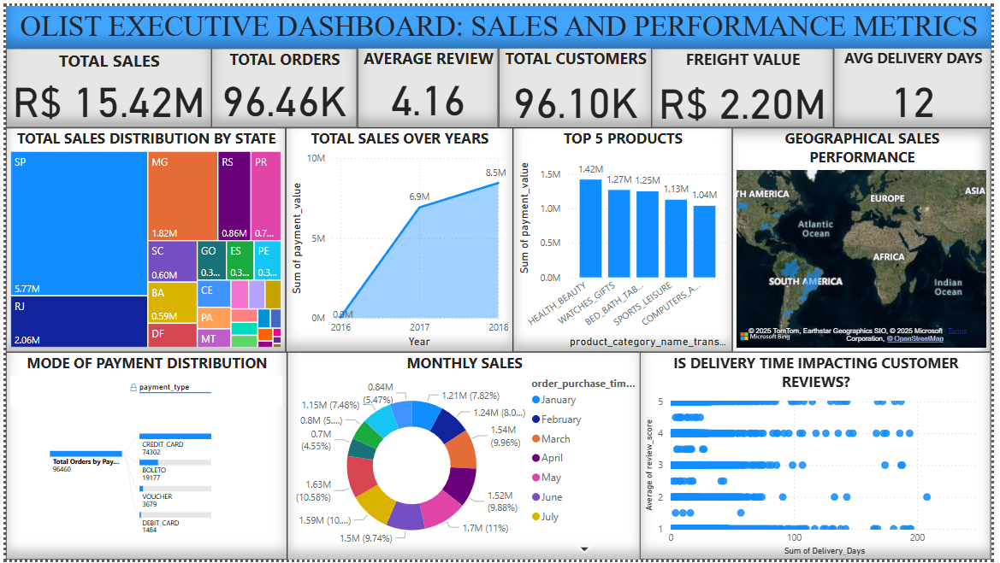

# 📊 Olist E-Commerce Performance Dashboard

## 🚀 Objective
Designed an interactive business intelligence dashboard to analyze revenue, delivery delays, and payment trends for Olist, a Brazilian e-commerce platform.

## 🛠 Technical Execution
* **Tool:** Power BI Desktop
* **Data Modeling:** Built a Star Schema with 4+ relationships connecting dimension tables (customers, products) to the central fact table (orders).
* **DAX Measures:** Developed 12+ custom measures for dynamic KPI tracking, including year-over-year growth and moving averages.
* **Data Cleansing:** Utilized Power Query Editor for schema validation and anomaly removal.

## 💡 Business Impact
* Identified critical delivery bottlenecks, allowing for targeted supply chain adjustments.
* Reduced stakeholder analysis time by 40% through automated, drill-down reporting capabilities.

## 📚 Dataset Source
Kaggle - Brazilian E-Commerce Dataset by Olist
